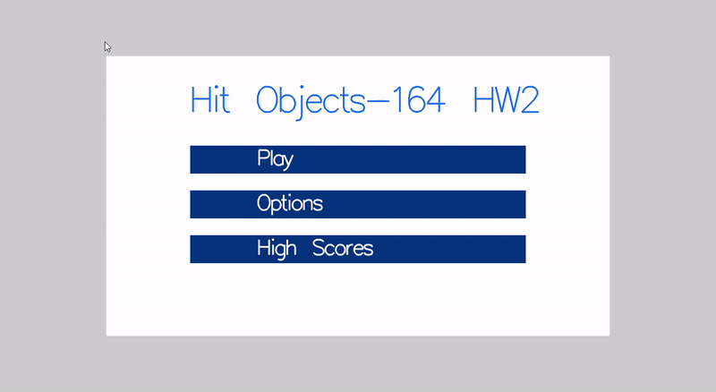
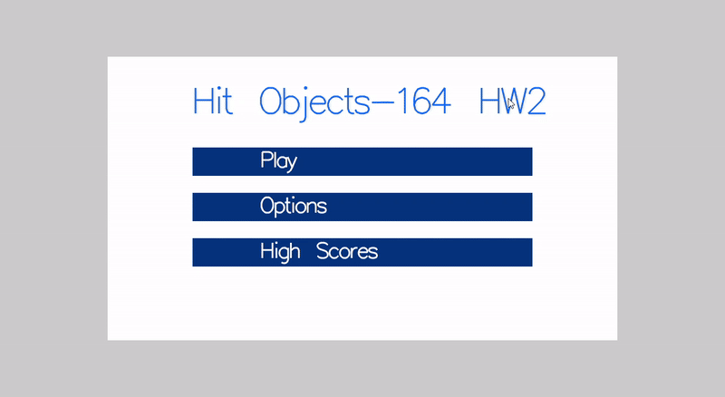

# Bird Hunter Game - C & OpenGL

Welcome to **Bird Hunter**, a dynamic arcade-style game built with **C** and **OpenGL**. In this game, you'll aim and shoot arrows at flying birds, earning points based on your accuracy and the distance from the center of the target.

## Features

### 🎮 Finite-State Machine:
- **Menu**: Choose between Play Game, Options, and High Scores.
- **Options**: Adjust the arrow speed with a dedicated settings interface.
- **Play Game**: The actual game state where you hunt birds.
- **Game Over**: Shows the high score and offers an option to play again.
- **User**: Input your username and save your scores to a text file.
- **High Scores**: Displays the top three highest scores using a bubble sort algorithm.

### 🕹️ Gameplay:
- Animated arrows and bow strings during shooting.
- Birds flap their wings as they fly across the screen.
- Scoreboard showing the remaining time, total objects launched, total objects hit, last score, and total score.
- Dynamic collision detection to calculate points based on distance from the target center.

## GIF Previews

### 🎮 Gameplay:



### 🛠️ Menu & Settings:



## How to Play

1. **Start the Game**: From the **Menu**, choose "Play Game" to start.
2. **Shoot Arrows**: Aim and shoot arrows at flying birds.
3. **Score Points**: Hit birds to earn points based on distance.
4. **Game Over**: Once the timer ends, see your score and high scores.
5. **Adjust Settings**: Customize arrow speed in the **Options** menu.
6. **Save High Scores**: Enter your username to save your score after a game.

## Installation

To run **Bird Hunter** on your local machine:

1. Clone the repository:
    ```bash
    git clone https://github.com/MoeinFaghih/huntGame.git
    cd bird-hunter
    ```
2. Compile the game with:
    ```bash
    gcc -o bird-hunter main.c -lGL -lGLU -lglut
    ```
3. Run the game:
    ```bash
    ./bird-hunter
    ```

## Technologies Used

- **C**: The programming language used for the game logic and structure.
- **OpenGL**: For graphics rendering and animations.
- **GLUT**: For window management and handling user inputs.

## License

This project is licensed under the MIT License - see the [LICENSE](LICENSE) file for details.

## Acknowledgments

- Thanks to the OpenGL community for providing valuable resources and tutorials.
- Special thanks to the contributors who made this game possible.
